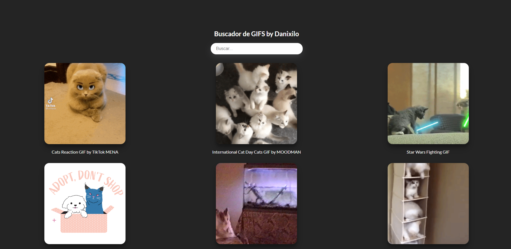

<h1>Proyecto de React con JavaScript utilizando la API GIPHY</h1>

Este proyecto utiliza React y JavaScript para crear una aplicación web que muestra gifs animados utilizando la API de GIPHY. La API de GIPHY proporciona un amplio conjunto de gifs que se pueden buscar y mostrar en la interfaz de usuario.

<h2>Funcionalidad principal</h2>

El proyecto consta de las siguientes características principales:

<ol>
  <li><strong>Búsqueda de gifs:</strong> Los usuarios pueden ingresar una palabra clave en la barra de búsqueda y la aplicación enviará una solicitud a la API de GIPHY para obtener gifs relacionados con la palabra clave. Los gifs se mostrarán en la interfaz de usuario.</li>
  <li><strong>Visualización de gifs:</strong> Los gifs se presentan en una cuadrícula de imágenes en la interfaz de usuario. Los usuarios pueden hacer clic en cada gif para ver una versión ampliada y obtener más detalles, como el título y el autor.</li>
</ol>

<h2>Tecnologías utilizadas</h2>

El proyecto se basa en las siguientes tecnologías:

<ul>
  <li><strong>React:</strong> Se utiliza para crear componentes reutilizables y gestionar el estado de la aplicación.</li>
  <li><strong>JavaScript:</strong> Se utiliza para la lógica de programación del proyecto, como el manejo de eventos y las solicitudes a la API de GIPHY.</li>
  <li><strong>API de GIPHY:</strong> Se utiliza para obtener gifs animados según las palabras clave de búsqueda ingresadas por los usuarios.</li>
</ul>

<h2>Flujo de trabajo</h2>

El flujo de trabajo típico de la aplicación es el siguiente:

<ol>
  <li>El usuario ingresa una palabra clave en la barra de búsqueda y presiona Enter o hace clic en el botón de búsqueda.</li>
  <li>La aplicación captura la palabra clave ingresada y envía una solicitud a la API de GIPHY utilizando la palabra clave como parámetro de búsqueda.</li>
  <li>La API de GIPHY devuelve una lista de gifs relacionados con la palabra clave.</li>
  <li>La aplicación recibe la respuesta de la API y muestra los gifs en la interfaz de usuario.</li>
  <li>El usuario puede hacer clic en cada gif para ver una vista ampliada y obtener más detalles.</li>
</ol>

<h2>Personalización y mejoras</h2>

Este proyecto puede personalizarse y mejorarse de varias maneras, como:

<ul>
  <li>Mejorar la interfaz de usuario y el diseño utilizando CSS o bibliotecas de componentes como Material-UI o Bootstrap.</li>
  <li>Implementar funcionalidades adicionales, como guardar gifs favoritos o compartir gifs en redes sociales.</li>
  <li>Añadir filtros avanzados para refinar los resultados de búsqueda, como filtrar por categoría o duración del gif.</li>
  <li>Implementar paginación para cargar más gifs a medida que el usuario se desplaza hacia abajo en la página.</li>
</ul>

Conclusión:

Este proyecto de React con JavaScript utilizando la API de GIPHY proporciona una manera sencilla de buscar y mostrar gifs animados en una aplicación web. Puedes personalizar y expandir el proyecto para adaptarlo a tus propias necesidades y seguir explorando las posibilidades de React y la API de GIPHY. ¡Diviértete creando tu propia experiencia interactiva de gifs animados!

